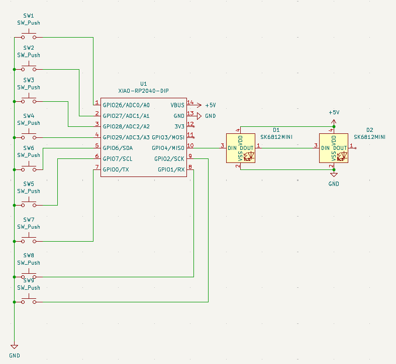

# Hackclub-macropad

A small programmable macropad for 3D modelling with 9 buttons and an OLED screen.

## Bill of Materials for this project)

- 1× 3D-printed case
- 1× Seeed XIAO RP2040
- 1x ssd1306 oled-0.91-128x32
- 1× PCB
- 4x M3x16mm screws
- 4x M3x5mx4mm heatset inserts
- 9× MX-Style switches
- 9x Blank DSA keycaps (White)

Repository layout
- `CAD/` — 3D files
- `PCB/` — PCB files
- `Firmware/` — Firmware files
