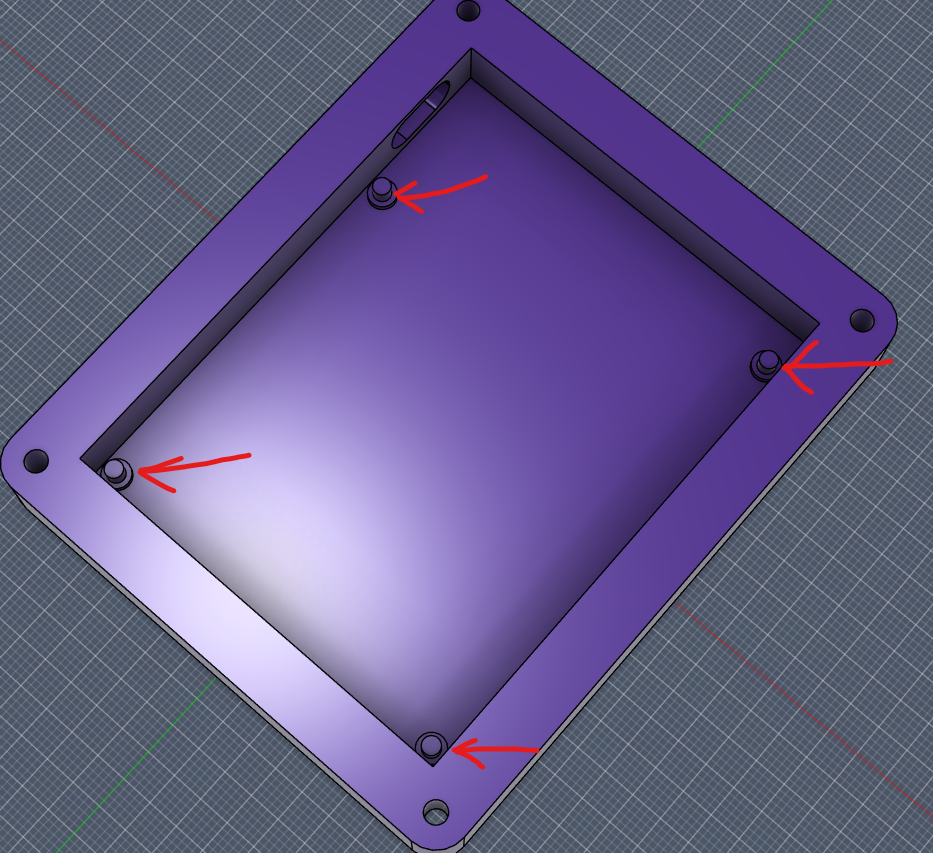
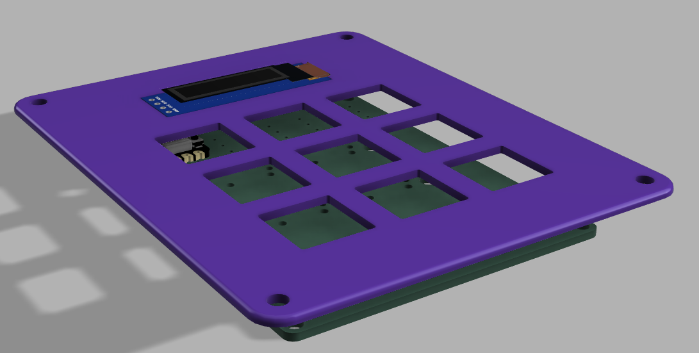
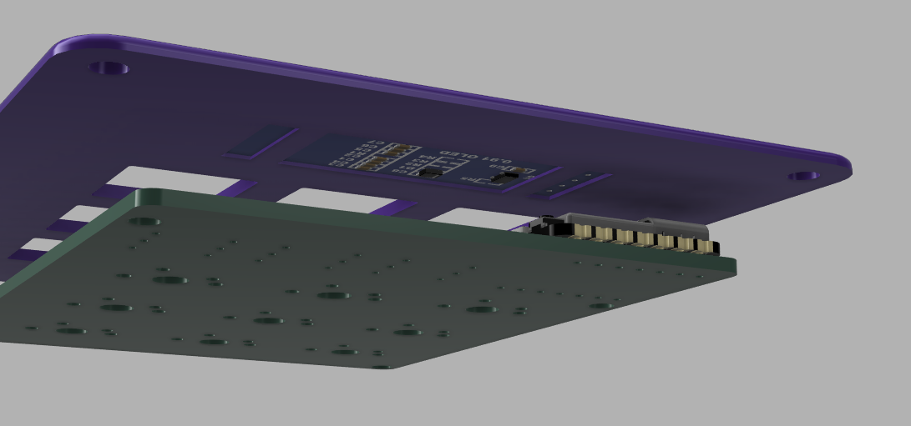
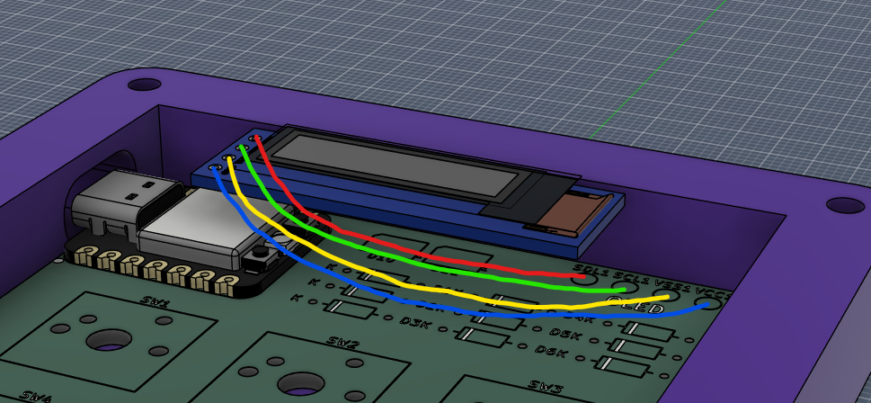
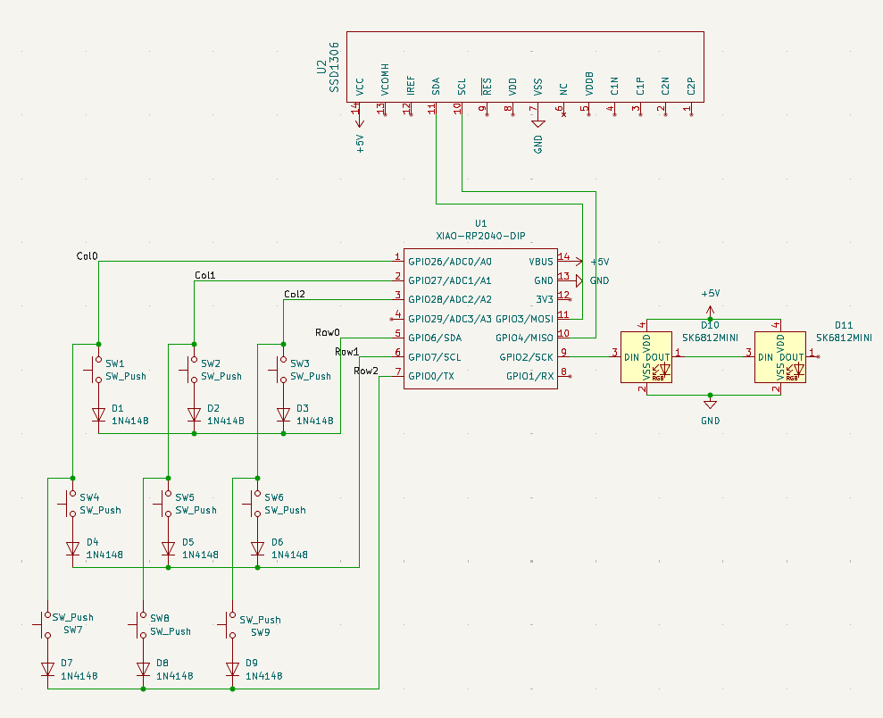
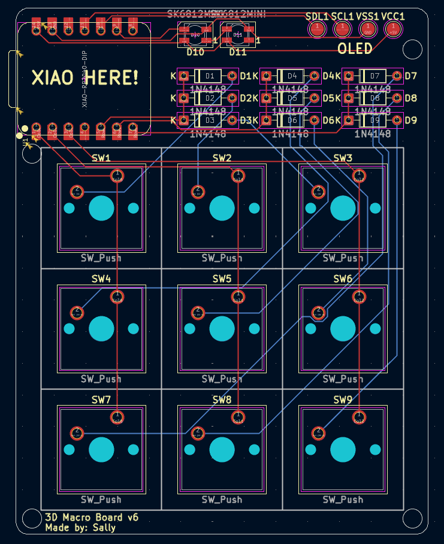
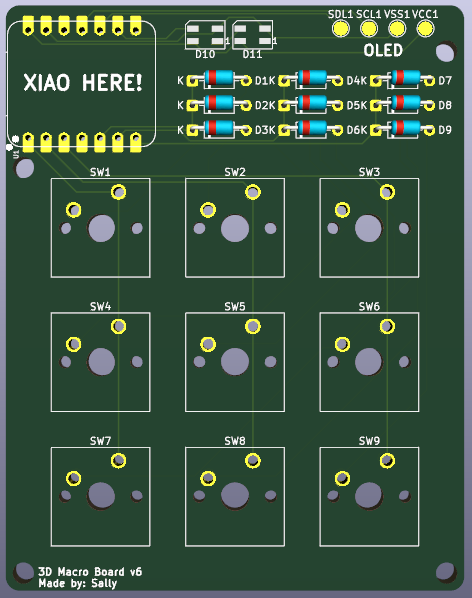

# Hackclub-macropad

A small programmable macropad for 3D modelling with 9 buttons, 2 status LEDs and an OLED screen. The OLED is mounted in the lid, so replacing it later is easy I'll just need to desolder four wires and print a new lid. The display connects to the PCB using four wires soldered to the pads located in the top right corner of the board.

## Bill of Materials for this project)

- 1× 3D-printed case
- 1× Seeed XIAO RP2040
- 1x ssd1306 oled-0.91-128x32
- 1× PCB
- 2x SK6812 MINI-E LEDs
- 4x M3x16mm screws
- 4x M3x5mx4mm heatset inserts
- 9x Through-hole 1N4148 Diodes
- 9× MX-Style switches
- 9x Blank DSA keycaps (White)

