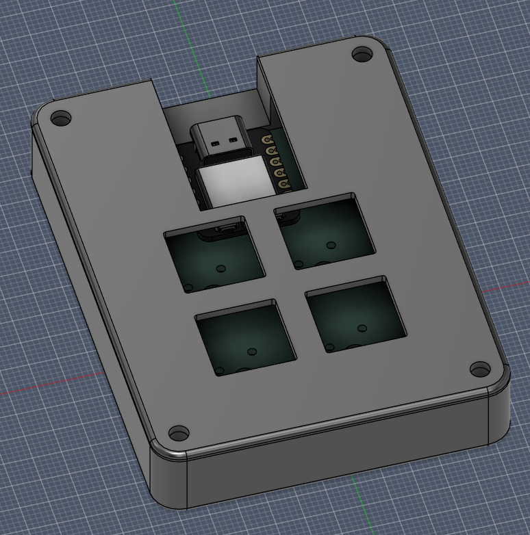

# Hackclub-macropad

A small programmable macropad for 3D modelling with 9 buttons.

## Bill of Materials for this project)

- 1× 3D-printed case
- 1× Seeed XIAO RP2040
- 1× PCB
- 2× SK6812 MINI-E LEDs
- 4× Mechanical switches
- 4× MX-Style switches
- 4x Blank DSA keycaps (White)
- 4x M3x16mm screws
- 4x M3x5mx4mm heatset inserts

Repository layout
- `CAD/` — 3D model files
- `PCB/` — PCB files
- `Firmware/` — Firmware files
